# Multi-User Image Gallery

This is a Django project for a multi-user image gallery application with role-based access control.

## Installation

1. Clone the repository:
    ```bash
    git clone https://github.com/AITMLOUK98/multi-user-django-app.git
    ```
2. Navigate to the project directory:
    ```bash
    cd multi-user-image-gallery
    ```
3. Create a virtual environment (optional but recommended):
    ```bash
    python -m venv venv
    ```
4. Activate the virtual environment:
    - On Windows:
        ```bash
        venv\Scripts\activate
        ```
    - On macOS/Linux:
        ```bash
        source venv/bin/activate
        ```
5. Install the required packages:
    ```bash
    pip install -r requirements.txt
    ```
6. Configure the database:
    - **Using PostgreSQL**: Edit the `DATABASES` setting in `settings.py` to configure your PostgresSQL database settings(in file setting I put the configuration of postgres).
    - **Using SQLite3 (default)**: No additional configuration is required for SQLite3.

7. Apply the database migrations:
    ```bash
    python manage.py migrate
    ```
8. Create a superuser (admin):
    ```bash
    python manage.py createsuperuser
    ```
9. Run the development server:
    ```bash
    python manage.py runserver
    ```
10. Access the admin interface at `http://127.0.0.1:8000/admin/` and log in with the superuser credentials.

11. You can now use the API endpoints to manage users, roles, image galleries, and images.

## API Endpoints

- **Token-based authentication**:
    - `POST /api/auth/token/`: Obtain a token by sending a username and password. Use the token for authentication in other requests.
     
- **Username/password authentication**:
    - `POST /api/auth/login/`: Log in using username and password.
     login as  Company User, or Subscriber
     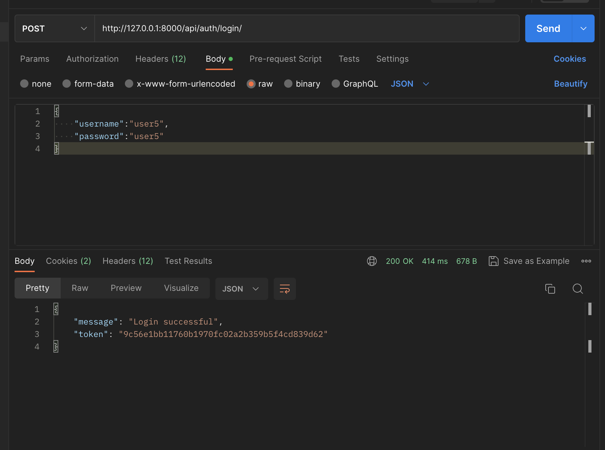
     login as admin or Beta Player
     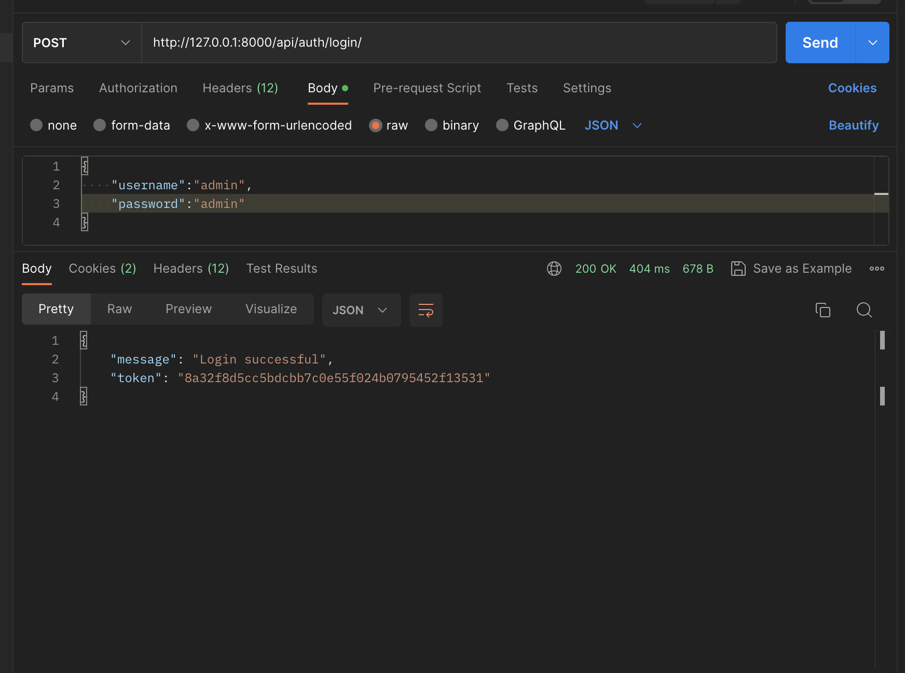

- **Logout**:
    - `POST /api/auth/logout/`: Log out the current user.
    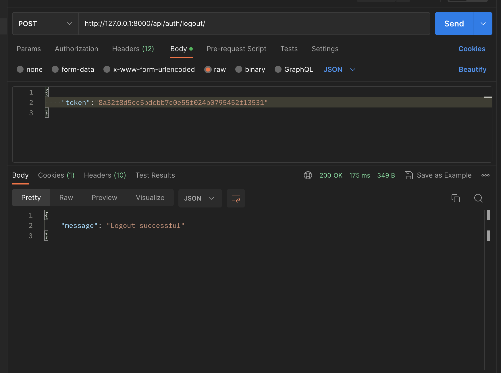
- **User registration**:
    - `POST /api/auth/register/`: Register a new user.
    role: password dose not match
    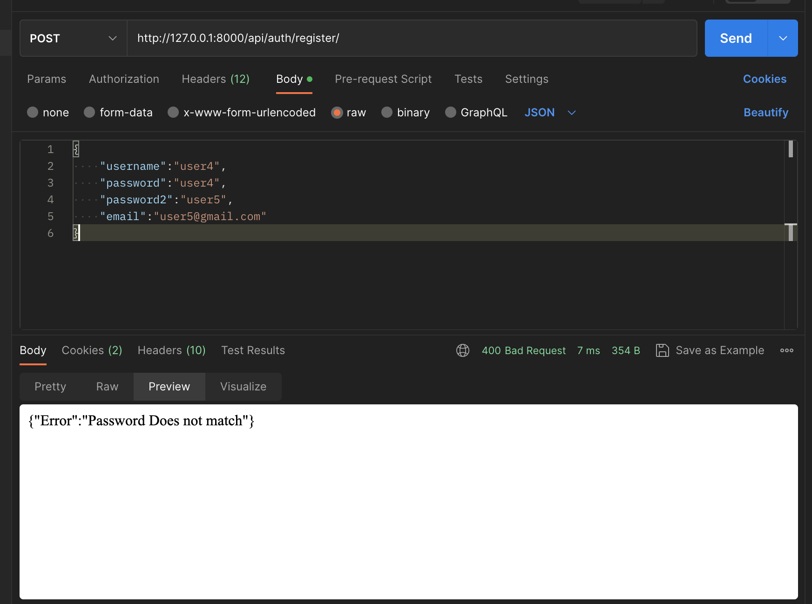
    - 
    role: Company User, or Subscriber
    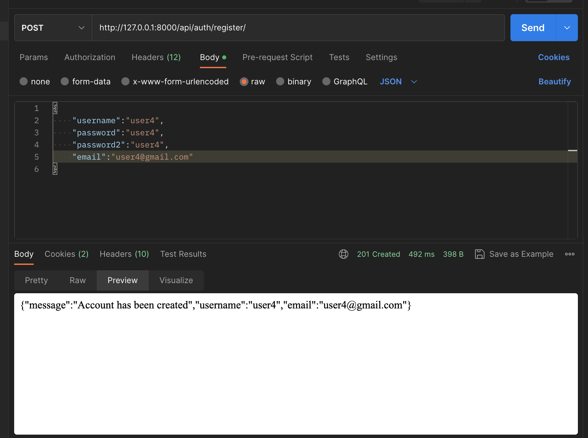
    - 
    user already exists
    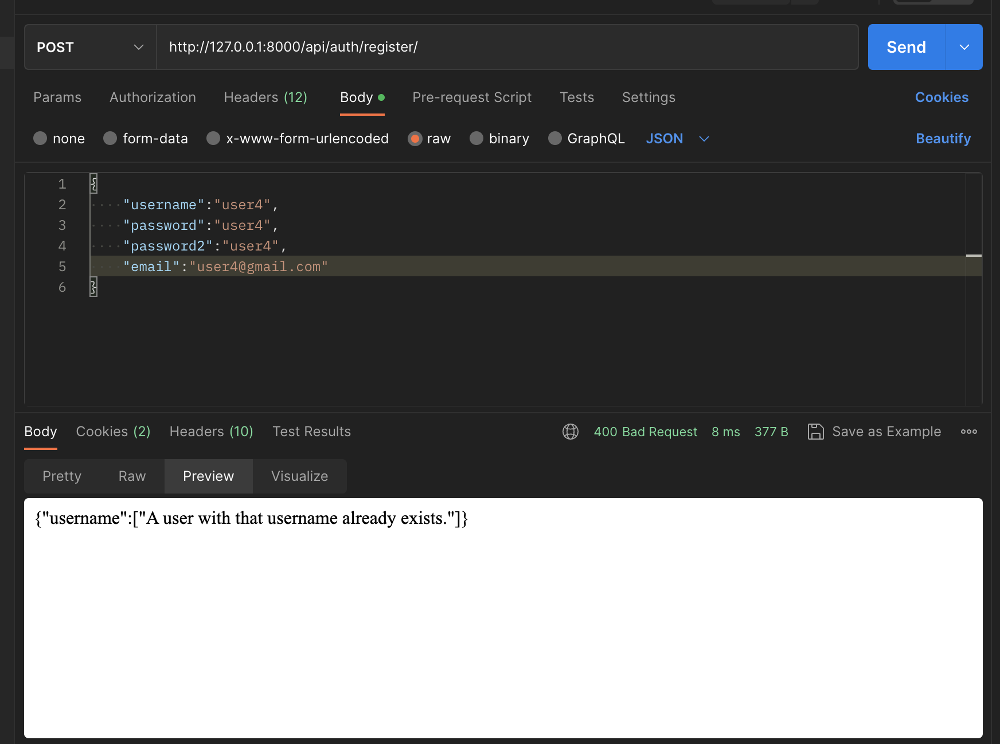
- **Image Galleries**:
    - `GET /api/gallery/images/`: List all image galleries.
    
    - `GET /api/gallery/images/{id}/`: Retrieve a specific image gallery.
    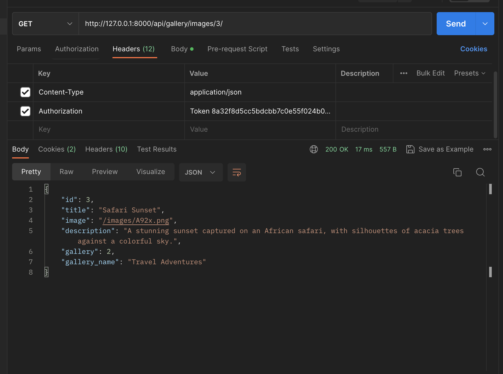
    - `GET /api/gallery/images/{id}/delete/`: Delete a specific image.
    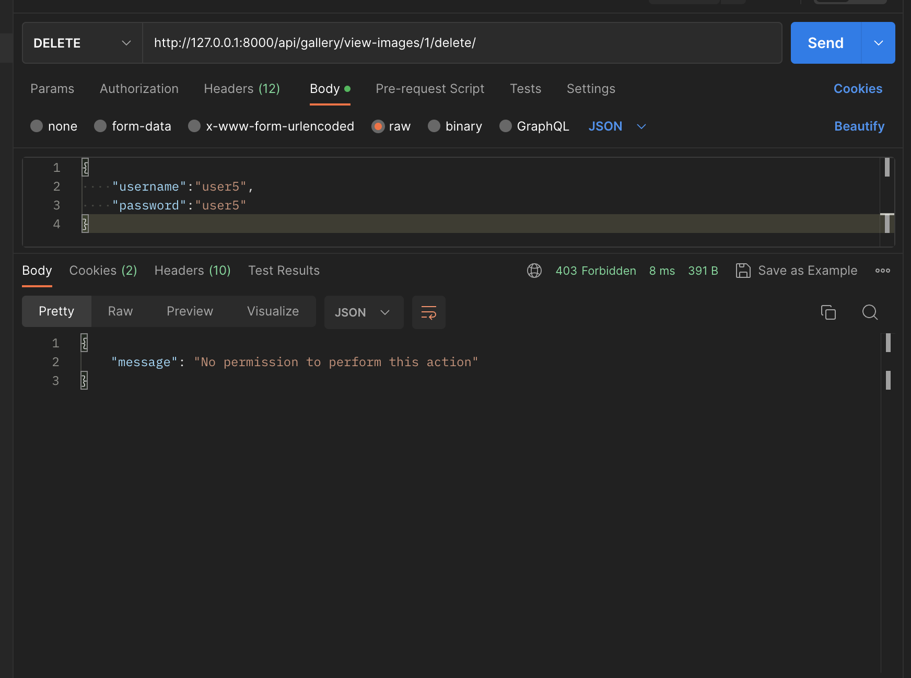
    - `GET /api/gallery/images/{id}/update/`: Update a specific image.
    - `GET /api/gallery/view-images/`: List all image galleries for users with no full access.
    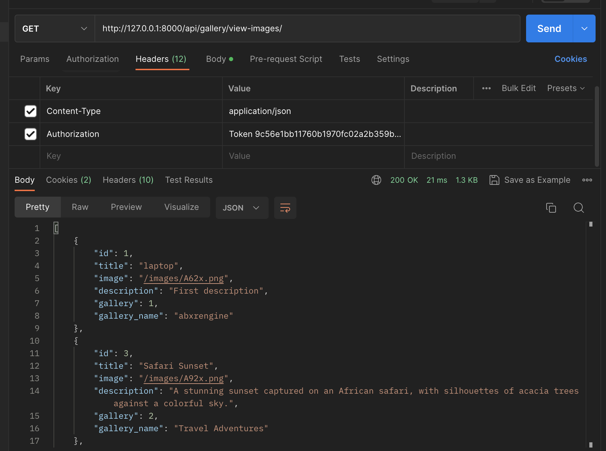
    - `GET /api/gallery/view-images/{id}/`: Retrieve a specific image gallery for users with no full access.
    
    - `GET /api/gallery/view-images/{id}/delete/`: Delete a specific image gallery for users with no full access.
    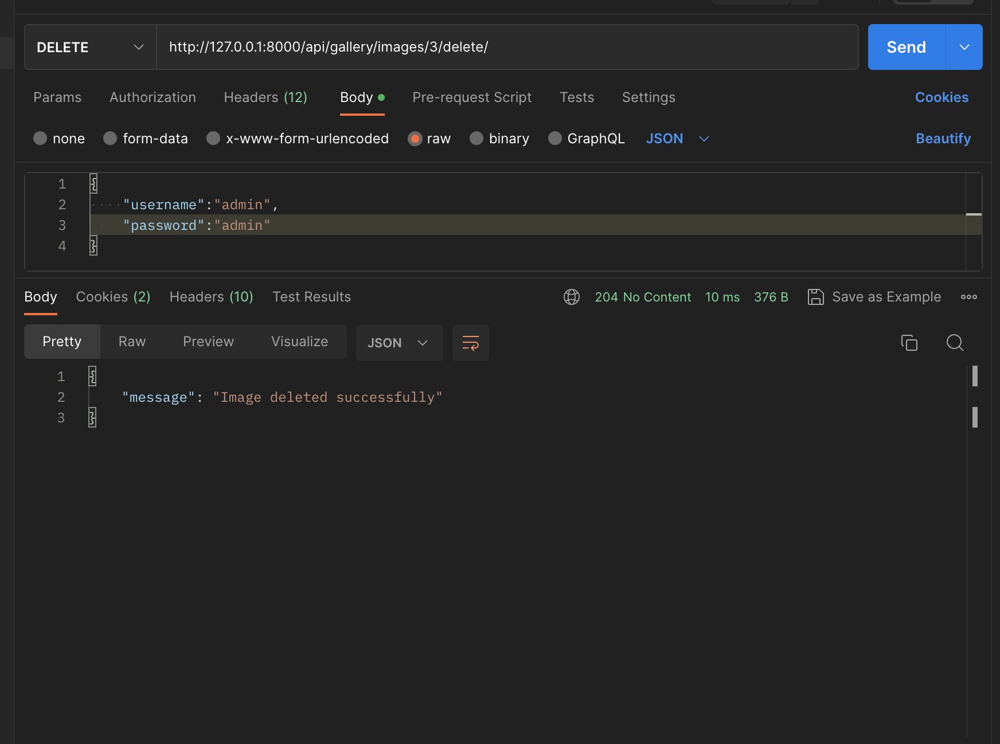
    - `GET /api/gallery/view-images/{id}/update/`: Update a specific image gallery for users with no full access.
    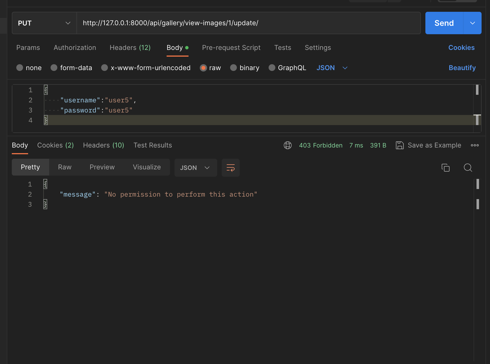

## Authentication

- Token-based authentication is used for API endpoints. Obtain a token by sending a POST request to `/api/auth/token/` with your username and password.
- Include the obtained token in the `Authorization` header of your API requests, e.g., `Authorization: Token <your_token_here>`.

## Roles

- The application supports three roles: Beta Player, Company User, and Subscriber.
- Each role has different levels of access and permissions within the application.

## Technologies Used

- Django
- Django REST framework
- PostgreSQL (or SQLite3)
- Token-based authentication

Developed by [Ait Mlouk Brahim](https://github.com/AITMLOUK98/multi-user-django-app)
